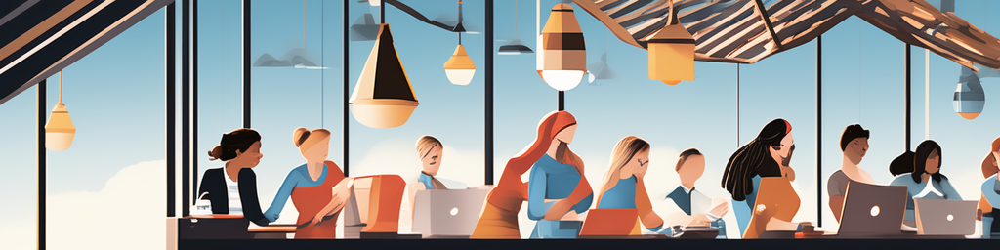

# Navigating the Siloed Maze: A UX Designer's Struggle 🤔

In the bustling realm of UX design, teams face a unique challenge: the ever-present threat of silos. These metaphorical walls, often erected by departmental boundaries and specialized roles, can confine creativity, hinder communication, and ultimately impede the success of UX projects.

Picture this: a UX designer pours their heart and soul into crafting an intuitive, engaging, and visually stunning user interface. But when the design reaches the development team, it's met with confusion and skepticism. The designer's vision is misinterpreted, key features are overlooked, and the final product falls short of its potential.

Why does this happen? The culprit is often the pervasiveness of silos, which create a disconnect between different departments and stifle open communication. Designers operate in their own bubble, developers in theirs, and the result is a product that fails to harmonize the needs of both users and stakeholders.

## Silo Buster: Strategies to Break Down Barriers 💪

The antidote to this silo-induced stagnation lies in fostering a collaborative culture that breaks down walls and brings teams together. Here are some actionable strategies to help UX designers break down silos and achieve seamless cross-functional collaboration:

### Alignment Takes Work

Establishing alignment across teams is crucial for breaking down silos and ensuring everyone is working towards a shared vision. Regularly share project updates, progress reports, and design decisions with the entire team, stakeholders, and sponsor users. This fosters open communication, builds trust, and keeps everyone on the same page.

### Diverge and Converge

To generate innovative solutions, embrace divergent thinking and encourage team members to come up with a multitude of ideas, even if they seem unconventional. This mindset fosters creativity and encourages the exploration of diverse perspectives. Once a rich pool of ideas has been gathered, converge on the most promising solutions, building upon each other's contributions to reach a consensus.

### Varied Perspectives Lead to Better Ideas

Diverse teams bring a wealth of experiences, backgrounds, and perspectives to the table. By tapping into this diversity, you gain access to a wider range of ideas and approaches, increasing the likelihood of breakthrough solutions that truly address user needs.

### Storytelling for Effective Communication

Facts and figures can be dry and easily overlooked, but stories have the power to capture attention, evoke emotions, and drive lasting impact. Utilize storytelling in Playbacks, which are regular gatherings to share progress, reflect on learnings, and align the team. By weaving narratives around project milestones, user feedback, and design decisions, you make information more memorable and engaging.

By incorporating these strategies, UX teams can effectively break down silos, foster open communication, and tap into the collective intelligence of diverse perspectives. This collaborative approach leads to better-informed decision-making, innovative solutions, and ultimately, products that truly resonate with users.

## Case Studies: Shining Examples of Collaborative UX ✨

The benefits of breaking down silos are undeniable, and many UX teams have successfully implemented collaborative strategies to achieve remarkable results. Here are a couple of inspiring examples:

### Case Study 1: Uber's Cross-Functional Design Sprints 🚙

Uber's design sprints incorporate representatives from various teams, including product management, engineering, marketing, and customer support. This cross-functional approach allows for the early identification of potential issues and ensures that the product is aligned with the needs of all stakeholders.

### Case Study 2: Airbnb's Design Language System 🏠

Airbnb's design language system, "Brave", is a single source of truth for design across the entire organization. This shared vocabulary and standards have significantly improved collaboration, reduced design inconsistencies, and enhanced the overall user experience.

## Conclusion: Embracing Collaboration for UX Nirvana 🚀

In the ever-evolving landscape of UX design, collaboration is not just a buzzword; it's the key to unlocking innovation, creating user-centered products, and achieving sustainable success. By breaking down silos, fostering open communication, and embracing cross-functional teamwork, UX teams can elevate their work to new heights, making a profound impact on the way users interact with technology.